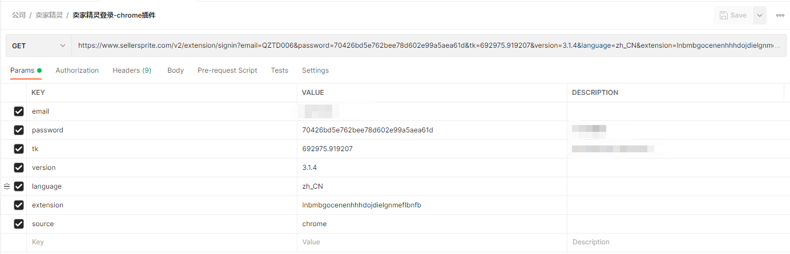

1.  chrome://version, 查看 `个人资料路径`

   ```bash
   C:\Users\用户名\AppData\Local\Google\Chrome\User Data\Default
   ```

2. 打开插件所在文件夹: `Extensions`, 目录如下:

   ```bash
   C:\Users\用户名\AppData\Local\Google\Chrome\User Data\Default\Extensions
   ```

3. `chrome://extensions/` 查看卖家精灵插件 ID

   ```bash
   ID：lnbmbgocenenhhhdojdielgnmeflbnfb
   ```

4. 根据插件ID, 寻找对应的文件夹并使用编辑器打开

5. 卖家精灵产品查询分析流程

   1. URL分析

      

   2. `tk` 参数分析

      1. B00DQFGJR4 不变, 更改 tk 的值, 提示无法使用此功能, 因此, tk 参数并不是随机生成的, 而是与 asin 有关

         

      2. 使用编辑器, 全局搜索 `tk` ,  发现 tk 参数, 都是由 `N.a.s2Tkk(t)` 方法生成

         ```js
               static asins(e, t) {
                         return ve(this, void 0, void 0, (function*() {
                       const a =
                                 yield n.a.get(`${this.ASINS_URL}/${e.code}`, {
                                     params: {
                                         asins: t,
                                         tk: N.a.s2Tkk(t)
                                     }
                                 });
                             return new Promise(e => e(this.parseList(a)))
                         }))
                     }
         ```
      
         调用 s2Tkk(t), 其中 t 参数和 asins: t, 为同一个, 因此得知, t: 为我们需要查询的 asin
      
      3. 进入 `s2Tkk` 方法
      
         ```js
                         static s2Tkk(e, t, s, a) {
                             let n = [],
                                 o = [e, t, s, a];
                             for (let e = 0; e < o.length; e++)
                                 if (o[e] && null != o[e] && o[e].toString().length > 0) {
                                     let t = n.length;
                                     for (let t = 0; o[e] instanceof Array && t < o[e].length; t++) n.push(o[e][t]);
                                     t === n.length && n.push(o[e].toString())
                                 }
                             return n.length < 1 ? "" : this._cal(n.join(""), this.EXT_VERSION)
                         }
         ```
      
         
      
         重点在于 `this._cal()` 方法与 `this.EXT_VERSION`参数
      
      4. Ctrl + F 查找 this._cal() 方法, 得到了我们需要的加密方法
      
         ```js
                         static _cal(e, t) {
                             function s(e, t) {
                                 for (var s = 0; s < t.length - 2; s += 3) {
                                     var a = t.charAt(s + 2);
                                     a = "a" <= a ? a.charCodeAt(0) - 87 : Number(a), a = "+" == t.charAt(s + 1) ? e >>> a : e << a, e = "+" == t.charAt(s) ? e + a & 4294967295 : e ^ a
                                 }
                                 return e
                             }
                             return function(e, t) {
                                 var a = t.split(".");
                                 t = Number(a[0]) || 0;
                                 for (var n = [], o = 0, i = 0; i < e.length; i++) {
                                     var r = e.charCodeAt(i);
                                     128 > r ? n[o++] = r : (2048 > r ? n[o++] = r >> 6 | 192 : (55296 == (64512 & r) && i + 1 < e.length && 56320 == (64512 & e.charCodeAt(i + 1)) ? (r = 65536 + ((1023 & r) << 10) + (1023 & e.charCodeAt(++i)), n[o++] = r >> 18 | 240, n[o++] = r >> 12 & 63 | 128) : n[o++] = r >> 12 | 224, n[o++] = r >> 6 & 63 | 128), n[o++] = 63 & r | 128)
                                 }
                                 for (e = t, o = 0; o < n.length; o++) e = s(e += n[o], "+-a^+6");
                                 return e = s(e, "+-3^+b+-f"), 0 > (e ^= Number(a[1]) || 0) && (e = 2147483648 + (2147483647 & e)), (a = e % 1e6).toString() + "." + (a ^ t)
                             }(e, t)
                         }
         ```
      
         在 static _cal(e,t) 这行下面, 添加, alert(e), alert(t), 查看 e, t 参数分别是什么
      
         ```bash
         e: "", # 为空
         t: B00DQFGJR4 # 为我们需要查询的 asin
         ```
      
         进一步进行的确认参数位置, 到这里需要的参数就分析完成了
      
         
      
      5. 同理可查找到, this.EXT_VERSION 参数
      
         ```js
                         static init() {
                             this.EXT_VERSION = a.a.version().replace(/\./, "00").replace(/\./g, "0") + ".1364508470"
                         }
         ```
      
         其中 `a.a.version()` 经过分析可以知道为, 卖家精灵的版本号: 3.1.4, 版本号会随时间而更新, 请注意
      
      6. 将上面的 js 代码整理一下, 如下
      
         ```js
         function extVersion() {
             // 就是插件的版本, 替换了 . 再拼接了一个字符串而成
             // 如果插件更新了版本, 手动更新一下插件的版本号即可
             chrome_ext_version = '3.1.4' //300104.1364508470
             return chrome_ext_version.replace(/\./, "00").replace(/\./g, "0") + ".1364508470"
         
         }
         
         function s2Tkk(e, t, s, a) {
             let n = [],
                 o = [e, t, s, a];
             for (let e = 0; e < o.length; e++)
                 if (o[e] && null != o[e] && o[e].toString().length > 0) {
                     let t = n.length;
                     for (let t = 0; o[e] instanceof Array && t < o[e].length; t++) n.push(o[e][t]);
                     t === n.length && n.push(o[e].toString())
                 }
             return n.length < 1 ? "" : _cal(n.join(""), extVersion())
         }
         
         function _cal(e, t) {
         
             function s(e, t) {
                 for (var s = 0; s < t.length - 2; s += 3) {
                     var a = t.charAt(s + 2);
                     a = "a" <= a ? a.charCodeAt(0) - 87 : Number(a), a = "+" == t.charAt(s + 1) ? e >>> a : e << a, e = "+" == t.charAt(s) ? e + a & 4294967295 : e ^ a
                 }
                 return e
             }
         
             return function (e, t) {
                 var a = t.split(".");
                 t = Number(a[0]) || 0;
                 for (var n = [], o = 0, i = 0; i < e.length; i++) {
                     var r = e.charCodeAt(i);
                     128 > r ? n[o++] = r : (2048 > r ? n[o++] = r >> 6 | 192 : (55296 == (64512 & r) && i + 1 < e.length && 56320 == (64512 & e.charCodeAt(i + 1)) ? (r = 65536 + ((1023 & r) << 10) + (1023 & e.charCodeAt(++i)), n[o++] = r >> 18 | 240, n[o++] = r >> 12 & 63 | 128) : n[o++] = r >> 12 | 224, n[o++] = r >> 6 & 63 | 128), n[o++] = 63 & r | 128)
                 }
                 for (e = t, o = 0; o < n.length; o++) e = s(e += n[o], "+-a^+6");
                 return e = s(e, "+-3^+b+-f"), 0 > (e ^= Number(a[1]) || 0) && (e = 2147483648 + (2147483647 & e)), (a = e % 1e6).toString() + "." + (a ^ t)
             }(e, t)
         }
         ```
      
      7. 使用 Python 进行调用
      
         ```python
         import execjs
         
         node = execjs.get()
         file = './sellersprite.js'
         ctx = node.compile(open(file, 'r', encoding='utf8').read())
         
         # 数据源的 tk
         e = ''
         t = 'B00DQFGJR4'
         
         print(ctx.call('s2Tkk', e, t)) 
         # 得到结果, 与我们抓包请求中的 tk 参数结果一致
         # 58497.291017
         ```
      
      8. 插件登录过程中的参数, 也是同理, 大家可以自行实践
      
         如需要帮助, 可以通过 [Github](https://github.com/CLannadZSY) 联系我
      
         

