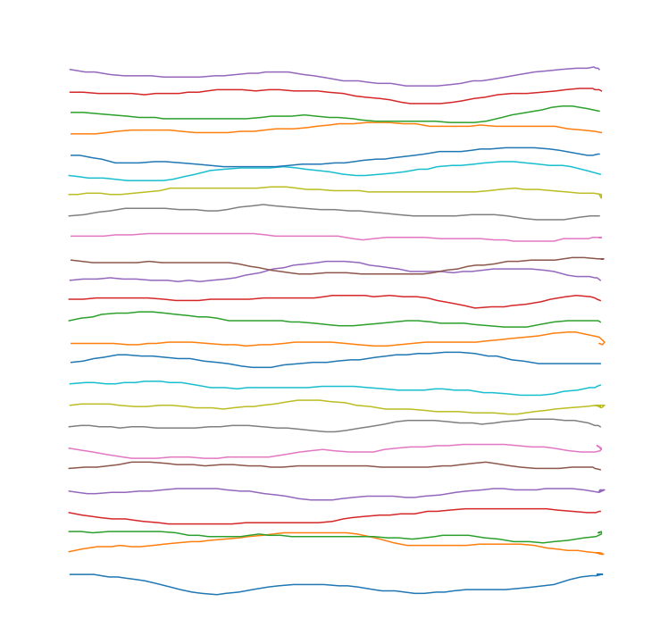

### WindMouse

```python
import numpy as np
sqrt3 = np.sqrt(3)
sqrt5 = np.sqrt(5)

def wind_mouse(start_x, start_y, dest_x, dest_y, G_0=9, W_0=3, M_0=15, D_0=12, move_mouse=lambda x,y: None):
    '''
    WindMouse algorithm. Calls the move_mouse kwarg with each new step.
    Released under the terms of the GPLv3 license.
    G_0 - magnitude of the gravitational fornce
    W_0 - magnitude of the wind force fluctuations
    M_0 - maximum step size (velocity clip threshold)
    D_0 - distance where wind behavior changes from random to damped
    '''
    current_x,current_y = start_x,start_y
    v_x = v_y = W_x = W_y = 0
    while (dist:=np.hypot(dest_x-start_x,dest_y-start_y)) >= 1:
        W_mag = min(W_0, dist)
        if dist >= D_0:
            W_x = W_x/sqrt3 + (2*np.random.random()-1)*W_mag/sqrt5
            W_y = W_y/sqrt3 + (2*np.random.random()-1)*W_mag/sqrt5
        else:
            W_x /= sqrt3
            W_y /= sqrt3
            if M_0 < 3:
                M_0 = np.random.random()*3 + 3
            else:
                M_0 /= sqrt5
        v_x += W_x + G_0*(dest_x-start_x)/dist
        v_y += W_y + G_0*(dest_y-start_y)/dist
        v_mag = np.hypot(v_x, v_y)
        if v_mag > M_0:
            v_clip = M_0/2 + np.random.random()*M_0/2
            v_x = (v_x/v_mag) * v_clip
            v_y = (v_y/v_mag) * v_clip
        start_x += v_x
        start_y += v_y
        move_x = int(np.round(start_x))
        move_y = int(np.round(start_y))
        if current_x != move_x or current_y != move_y:
            #This should wait for the mouse polling interval
            move_mouse(current_x:=move_x,current_y:=move_y)
    return current_x,current_y
```

### Example
```python
import matplotlib.pyplot as plt

fig = plt.figure(figsize=[13,13])
plt.axis('off')
for y in np.linspace(-200,200,25):
    points = []
    wind_mouse(0,y,500,y,move_mouse=lambda x,y: points.append([x,y]))
    points = np.asarray(points)
    plt.plot(*points.T)
plt.xlim(-50,550)
plt.ylim(-250,250)
```



WindMouse 示例可以与本文前面的人类示例进行比较。 正如您所看到的，这些相对有说服力，而且看起来并不是特别机器生成的。 这里使用了 WindMouse 的默认参数，同样，这些参数不一定适合每个用例，并且可以针对特定用例进行调整以获得不同的结果。 例如，将风参数设置为等于重力参数将生成更多的漫步路径。


## 转载: [WindMouse](https://ben.land/post/2021/04/25/windmouse-human-mouse-movement/)